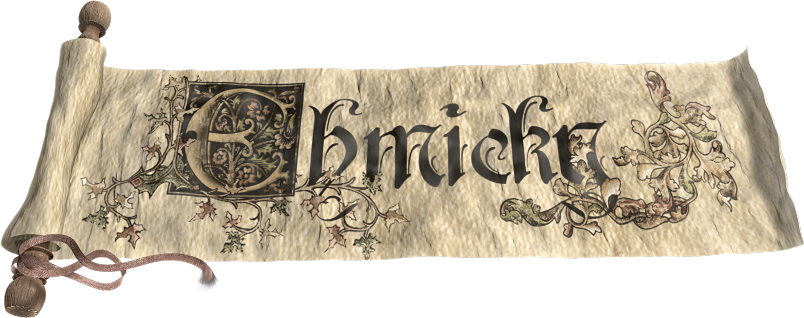

Examples of 3D scenes created with Blender.

Those were done in my spare time, as a humble amateur, and are far from matching the level of a professional artist. However, this gave me
some great insights and interest into 3D from an artist standpoint.

